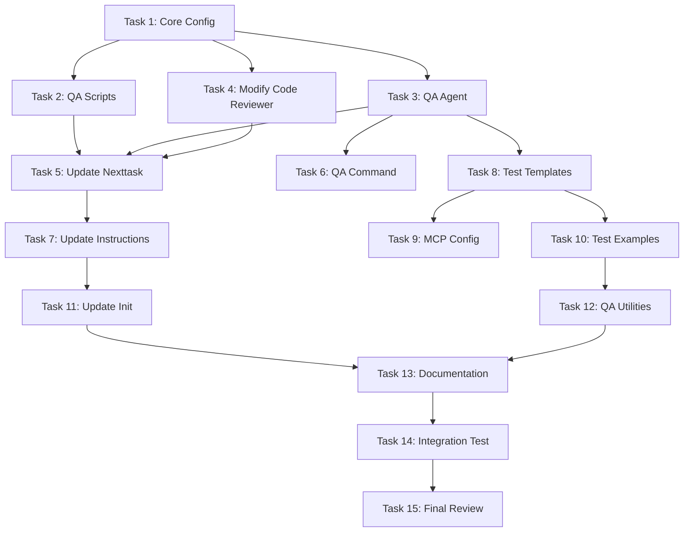

## AutoVibe QA Integration - Implementation Plan

### Overview

We'll implement a QA workflow where:

1. Code reviewer determines if QA is needed and routes to "Pending QA"
2. QA agent analyzes the task to determine what tests are needed
3. QA agent writes appropriate tests based on the task type
4. QA agent executes tests and validates results
5. QA agent either passes (merges) or fails the task back to "In Progress"

### Architecture Decisions

- **Separation of Concerns**: Coder writes code, QA agent writes and runs QA tests
- **Smart Test Detection**: QA agent determines test types from task analysis
- **Python-First Backend**: Use pytest for backend, Playwright for frontend
- **MCP Integration**: Playwright MCP for web testing by default
- **Visual Regression**: Include screenshot comparison for UI tasks

------

## Implementation Tasks

### Task 1: Update Core Configuration

**Scope**: Modify configuration files to support new QA workflow statuses

**Files to modify**:

- `backlog/config.yml` - Add new statuses
- `.claude/hooks.json` - Add QA hook configuration

**Deliverables**:

yaml

```yaml
# backlog/config.yml changes
statuses: ["To Do", "In Progress", "Pending Review", "Failed Review", "Pending QA", "Failed QA", "Done"]
```

------

### Task 2: Create QA Detection Scripts

**Scope**: Create shell scripts to find tasks in QA-related statuses

**Files to create**:

- `.scripts/find_qa_task.sh` - Find "Pending QA" tasks
- `.scripts/find_failed_qa_task.sh` - Find "Failed QA" tasks

**Deliverables**:

- Two working shell scripts following the pattern of existing find scripts
- Executable permissions set

------

### Task 3: Create QA Tester Agent

**Scope**: Create the main QA agent that handles test creation and execution

**Files to create**:

- `.claude/agents/qa-tester.md`

**Agent capabilities**:

- Analyze task to determine test requirements
- Detect project type from file changes
- Write appropriate test files
- Execute test suites
- Validate results
- Handle pass/fail workflow

**Key features**:

- Smart detection of frontend/backend/mobile changes
- Automatic test type selection (unit/integration/e2e)
- MCP integration for Playwright when needed

------

### Task 4: Modify Code Reviewer Agent

**Scope**: Update code reviewer to route to QA when appropriate

**Files to modify**:

- `.claude/agents/code-reviewer.md`

**Changes**:

- Analyze task for QA requirements
- Check for UI/frontend/user-facing changes
- Route to "Pending QA" instead of "Done" when QA needed
- Add decision logic documentation

------

### Task 5: Update Nexttask Command

**Scope**: Add QA workflow to the task orchestration

**Files to modify**:

- `.claude/commands/nexttask.md`

**Changes**:

- Add Priority 2.5: QA Check (between Review and Failed Review)
- Add Priority 3.5: Failed QA Check
- Update documentation for new workflow

------

### Task 6: Create QA Command

**Scope**: Create command for manual QA invocation

**Files to create**:

- `.claude/commands/qatask.md`

**Purpose**:

- Manual QA testing trigger
- Similar to codereview command structure

------

### Task 7: Update Agent Instructions

**Scope**: Document QA standards and workflow

**Files to modify**:

- `backlog/docs/doc-1 - AGENT_INSTRUCTIONS.md`

**Additions**:

- QA workflow documentation
- Test organization standards
- When QA is required
- Test writing guidelines
- Directory structure for tests

------

### Task 8: Create Test Structure Templates

**Scope**: Create standard test directory structure and examples

**Files to create**:

```
tests/
├── unit/
│   ├── __init__.py
│   └── test_example.py
├── integration/
│   ├── __init__.py
│   └── test_api_example.py
├── e2e/
│   ├── __init__.py
│   ├── test_web_example.py
│   └── screenshots/
│       └── .gitkeep
├── qa/
│   └── test_plans.md
├── conftest.py
└── pytest.ini
```

------

### Task 9: Add MCP Configuration

**Scope**: Configure Playwright MCP for web testing

**Files to create/modify**:

- `.mcp.json` - Add Playwright MCP configuration
- `requirements.txt` - Add pytest, playwright dependencies

**Configuration**:

json

```json
{
  "mcpServers": {
    "playwright": {
      "command": "npx",
      "args": ["@playwright/mcp-server"],
      "env": {}
    }
  }
}
```

------

### Task 10: Create QA Test Examples

**Scope**: Create example tests for different project types

**Files to create**:

- `tests/examples/web_test_example.py`
- `tests/examples/api_test_example.py`
- `tests/examples/mobile_test_example.py`

**Purpose**:

- Reference templates for QA agent
- Documentation for developers

------

### Task 11: Update Project Initialization

**Scope**: Modify startproject command to include QA setup

**Files to modify**:

- `.claude/commands/startproject.md`

**Changes**:

- Ask about QA requirements during project setup
- Create test structure during initialization
- Set default test frameworks based on project type

------

### Task 12: Create QA Utilities

**Scope**: Helper scripts for test execution and reporting

**Files to create**:

- `.scripts/run_qa_tests.py` - Intelligent test runner
- `.scripts/qa_report_generator.py` - Generate test reports

**Features**:

- Auto-detect which tests to run
- Generate readable test reports
- Handle different test frameworks

------

### Task 13: Documentation and Examples

**Scope**: Create comprehensive documentation

**Files to create**:

- `backlog/docs/doc-10 - QA_GUIDE.md` - Complete QA guide
- `README_QA.md` - QA-specific readme

**Content**:

- QA workflow explanation
- Test writing guidelines
- Framework choices
- Examples for each project type

------

### Task 14: Integration Testing

**Scope**: Test the complete QA workflow

**Validation**:

- Create a sample task that requires QA
- Run through complete workflow
- Verify all agents work correctly
- Test failure scenarios

------

### Task 15: Final Review and Optimization

**Scope**: Polish and optimize the implementation

**Activities**:

- Review all agent instructions for clarity
- Optimize test detection logic
- Ensure proper error handling
- Update main README with QA workflow

------

## Implementation Order and Dependencies

mermaid



## Key Design Decisions

1. **Automatic QA Detection**: The code reviewer will analyze:
   - File changes (frontend files = needs QA)
   - Task description keywords (UI, user-facing, visual)
   - Acceptance criteria mentioning user interaction
2. **Test Type Mapping**:
   - `src/components/` → E2E + Visual tests
   - `src/api/` → Integration tests
   - `src/services/` → Unit + Integration tests
   - `src/mobile/` → Mobile E2E tests
3. **Framework Defaults**:
   - Backend: pytest (Python)
   - Web E2E: Playwright (via MCP)
   - API: pytest with requests
   - Visual: Playwright screenshots
   - Mobile: Appium (when needed)
4. **QA Agent Intelligence**:
   - Reads task file and analyzes acceptance criteria
   - Determines test requirements
   - Writes tests in appropriate directory
   - Executes only relevant test suites
   - Provides detailed failure reports

## Success Criteria

-  QA workflow seamlessly integrates with existing review process
-  QA agent can automatically determine test requirements
-  Tests are written and maintained separately from implementation
-  Visual regression testing works for UI changes
-  Clear documentation for extending test types
-  No manual intervention needed for standard workflows

## Estimated Effort

Each task is designed to be completed in a single session with appropriate context. The entire implementation should take approximately 15-20 focused development sessions.